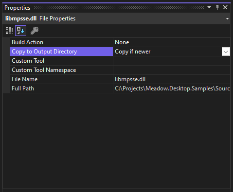
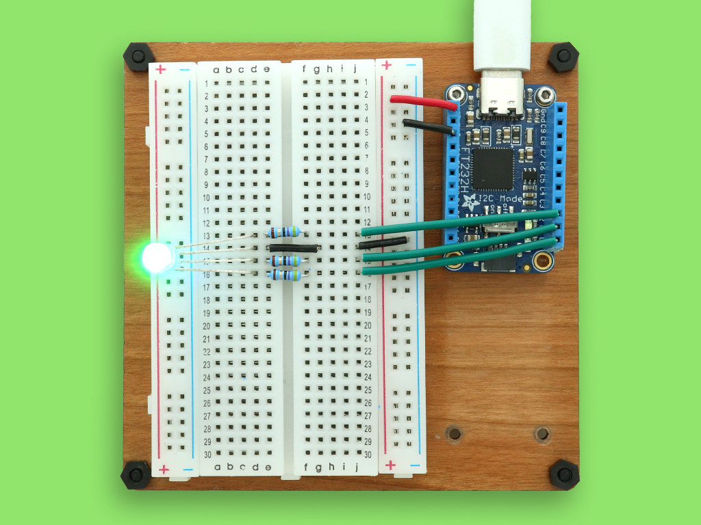
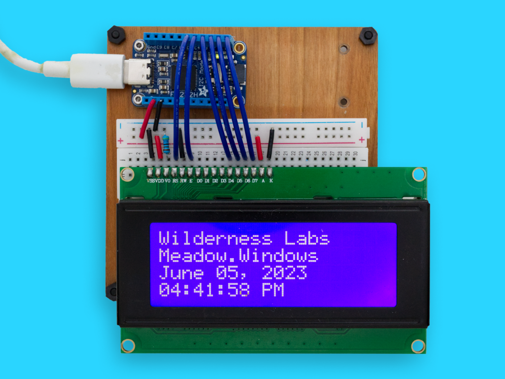
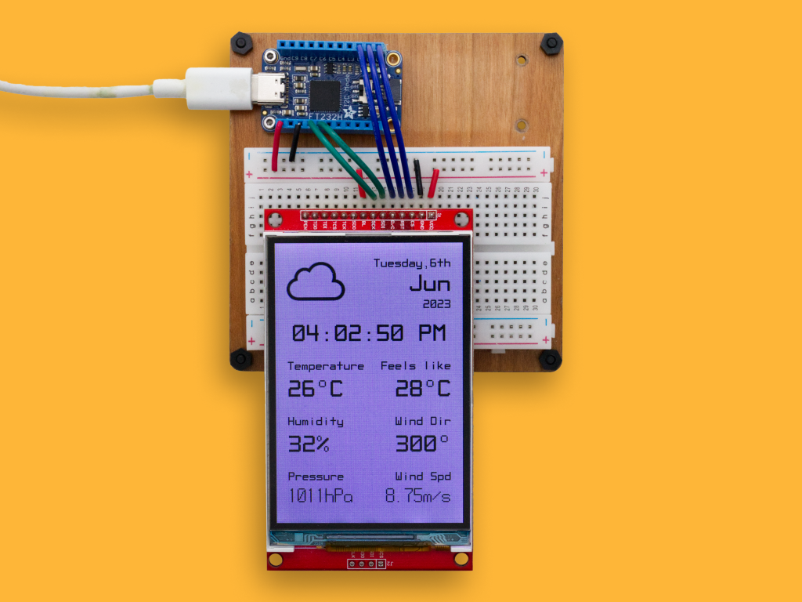

# Meadow.Desktop.Samples

Public project samples for Meadow.Windows and Meadow.Linux. Click on any of the projects to open the source code and run it.

## Contents
- [Windows](#windows)
    - [Pre-requisites](#pre-requisites)
    - [Meadow Windows Samples](#meadow-windows-samples)
- [Linux](#linux)
    - [Meadow Linux Samples](#meadow-linux-samples)
- [Support](#support)

## Windows

### Pre-Requisites

To run these samples, make sure:

1. Your development environment is [properly configured](http://developer.wildernesslabs.co/Meadow/Getting_Started/Getting_Started_Meadow.Desktop/Getting_Started_Windows/) to run Meadow apps on Windows.
2. The sample you wish to run, add the native library (libmpsse.dll) of the FT232H IO Expander depending on your CPU's architecture ([Win32 or x64](Support Files/FT232H Native Library/)) to that project and set the **Copy to Output Directory** to `Copy if newer` or `Copy always`

    

3. Rebuild and right-click the project and click on **Set as Startup Project** 
4. Click **Debug** to run see a Meadow App running on Windows!

### Meadow Windows Samples

<table>
    <tr>
        <td>
             
            Control an RGB LED with an FT232H IO Expander 
            <a href="Source/Windows/Blinky/">Source Code</a>
        </td>
        <td>
             
            Using a Character Display with an FT232H IO Expander 
            <a href="Source/Windows/CharacterDisplaySample/">Source Code</a>
        </td>
        <td>
             
            Show weather data on a display with an FT232H IO Expander 
            <a href="Source/Windows/WifiWeather/">Source Code</a>
        </td>
    </tr>
    <tr>
        <td>
            
&nbsp;&nbsp;&nbsp;&nbsp;&nbsp;&nbsp;&nbsp;&nbsp;&nbsp;&nbsp;&nbsp;&nbsp;&nbsp;&nbsp;&nbsp;&nbsp;&nbsp;&nbsp;&nbsp;&nbsp;&nbsp;&nbsp;&nbsp;&nbsp;&nbsp;&nbsp;&nbsp;&nbsp;&nbsp;&nbsp;&nbsp;&nbsp;

        </td>
        <td>
            
&nbsp;&nbsp;&nbsp;&nbsp;&nbsp;&nbsp;&nbsp;&nbsp;&nbsp;&nbsp;&nbsp;&nbsp;&nbsp;&nbsp;&nbsp;&nbsp;&nbsp;&nbsp;&nbsp;&nbsp;&nbsp;&nbsp;&nbsp;&nbsp;&nbsp;&nbsp;&nbsp;&nbsp;&nbsp;&nbsp;&nbsp;&nbsp;

        </td>
        <td>
            
&nbsp;&nbsp;&nbsp;&nbsp;&nbsp;&nbsp;&nbsp;&nbsp;&nbsp;&nbsp;&nbsp;&nbsp;&nbsp;&nbsp;&nbsp;&nbsp;&nbsp;&nbsp;&nbsp;&nbsp;&nbsp;&nbsp;&nbsp;&nbsp;&nbsp;&nbsp;&nbsp;&nbsp;&nbsp;&nbsp;&nbsp;&nbsp;

        </td>
    </tr>
</table>

## Linux

Instructions and samples coming soon...

### Meadow Linux Samples

<table>
    <tr>
        <td>
            
&nbsp;&nbsp;&nbsp;&nbsp;&nbsp;&nbsp;&nbsp;&nbsp;&nbsp;&nbsp;&nbsp;&nbsp;&nbsp;&nbsp;&nbsp;&nbsp;&nbsp;&nbsp;&nbsp;&nbsp;&nbsp;&nbsp;&nbsp;&nbsp;&nbsp;&nbsp;&nbsp;&nbsp;&nbsp;&nbsp;&nbsp;&nbsp;

        </td>
        <td>
            
&nbsp;&nbsp;&nbsp;&nbsp;&nbsp;&nbsp;&nbsp;&nbsp;&nbsp;&nbsp;&nbsp;&nbsp;&nbsp;&nbsp;&nbsp;&nbsp;&nbsp;&nbsp;&nbsp;&nbsp;&nbsp;&nbsp;&nbsp;&nbsp;&nbsp;&nbsp;&nbsp;&nbsp;&nbsp;&nbsp;&nbsp;&nbsp;

        </td>
        <td>
            
&nbsp;&nbsp;&nbsp;&nbsp;&nbsp;&nbsp;&nbsp;&nbsp;&nbsp;&nbsp;&nbsp;&nbsp;&nbsp;&nbsp;&nbsp;&nbsp;&nbsp;&nbsp;&nbsp;&nbsp;&nbsp;&nbsp;&nbsp;&nbsp;&nbsp;&nbsp;&nbsp;&nbsp;&nbsp;&nbsp;&nbsp;&nbsp;

        </td>
    </tr>
</table>

## Support

Having trouble running these samples? 
* File an [issue](https://github.com/WildernessLabs/Meadow.Desktop.Samples/issues) with a repro case to investigate, and/or
* Join our [public Slack](http://slackinvite.wildernesslabs.co/), where we have an awesome community helping, sharing and building amazing things using Meadow.