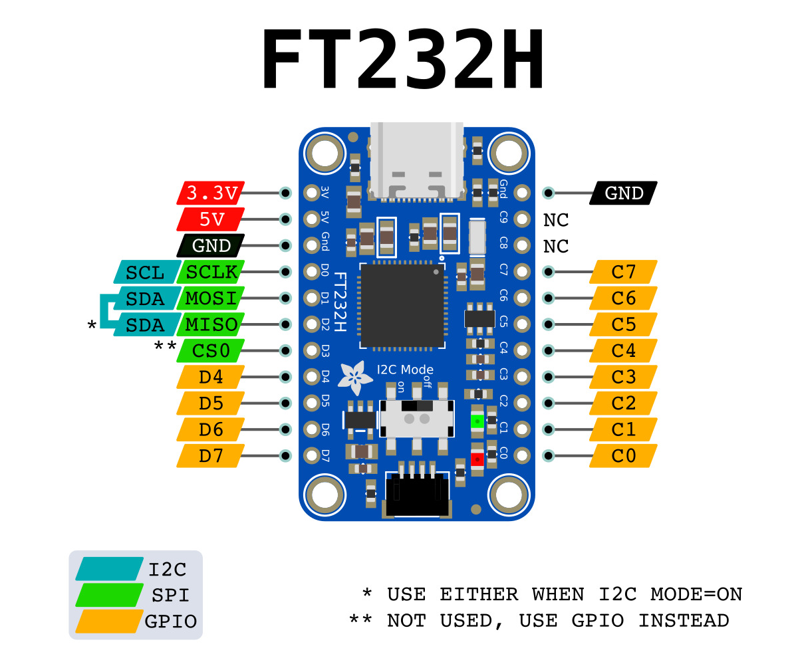
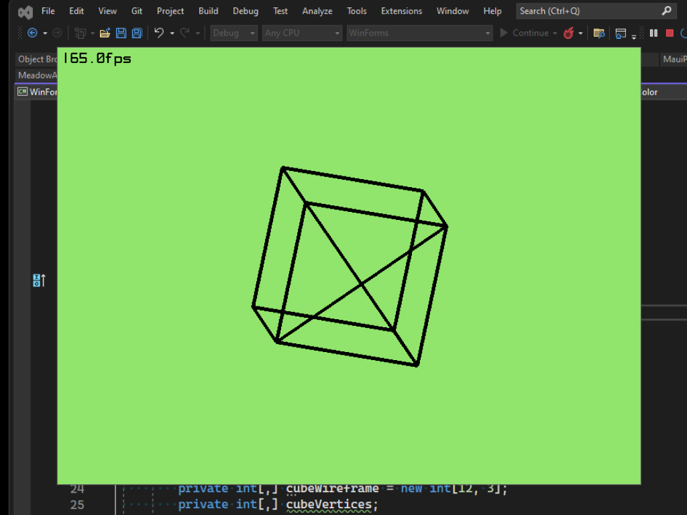
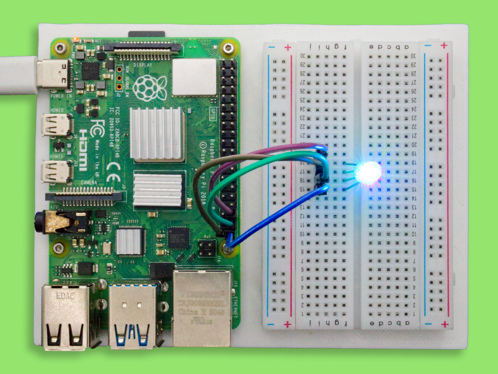
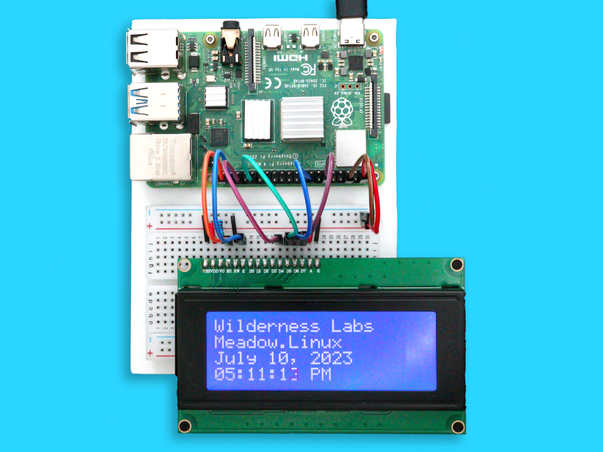

# Meadow.Desktop.Samples

Public project samples for [Meadow.Windows](http://developer.wildernesslabs.co/Meadow/Getting_Started/Getting_Started_Meadow.Desktop/Getting_Started_Windows/) and [Meadow.Linux](http://developer.wildernesslabs.co/Meadow/Getting_Started/Getting_Started_Meadow.Desktop/Getting_Started_Linux/). Click on any of the projects to open the source code and run it.

## Contents
- [Windows](#windows)
    - [Pre-requisites](#pre-requisites)
    - [Meadow Windows Samples](#meadowwindows-samples)
    - [IO expander pinout diagrams](#io-expander-pinout-diagrams)
        - [FT232H IO Expander](#ft232h-io-expander)
- [Linux](#linux)
    - [Meadow Linux Samples](#meadowlinux-samples)
    - [Linux embedded pinout diagrams](#linux-embedded-pinout-diagrams)
        - [Raspberry Pi 4](#raspberry-pi-4)
- [Support](#support)

## Windows

### Pre-Requisites

To run these samples, make sure:

1. Your development environment is [properly configured](http://developer.wildernesslabs.co/Meadow/Getting_Started/Getting_Started_Meadow.Desktop/Getting_Started_Windows/) to run Meadow apps on Windows.
2. [Optional] If the sample you wish to run uses a physical peripheral or sensor, add the native library (`libmpsse.dll`) of the FT232H IO Expander depending on your CPU's architecture ([Win32 or x64](/Support%20Files/Windows/FT232H%20Native%20Library/))  to that project and set the **Copy to Output Directory** to `Copy if newer` or `Copy always`

    

Also check the pinout to make sure to connect the peripheral or sensor on the right pins:

    

3. Rebuild and right-click the project and click on **Set as Startup Project** 
4. Click **Debug** to run see a Meadow App running on Windows!

### Meadow.Windows Samples

<table>
    <tr>
        <td>
             
            Running Blinky app with an FT232H IO Expander 
            <a href="https://www.hackster.io/wilderness-labs/run-meadow-apps-directly-from-your-pc-using-meadow-windows-dab4bf">Hackster</a> | <a href="Source/Windows/Blinky/">Source Code</a>
        </td>
        <td>
             
            Using a Character Display with an FT232H IO Expander 
            <a href="https://www.hackster.io/wilderness-labs/control-an-lcd-display-with-your-pc-using-meadow-windows-186c6d">Hackster</a> | <a href="Source/Windows/CharacterDisplaySample/">Source Code</a>
        </td>
        <td>
             
            Show weather data on a display with an FT232H IO Expander 
            <a href="https://www.hackster.io/wilderness-labs/build-this-weather-widget-running-directly-from-your-pc-57c69f">Hackster</a> | <a href="Source/Windows/WifiWeather/">Source Code</a>
        </td>
    </tr>
    <tr>
        <td>
             
            Run MicroGraphics on Windows using Meadow.WinForms 
            <a href="Source/Windows/Max7219/">Source Code</a>
        </td>
        <td>
             
            Show environmental data from XXXXXX sensor on a MAUI app 
            <a href="Source/Windows/CharacterDisplaySample/">Source Code</a>
        </td>
        <td>
             
            Show number of clicks on a display with Meadow.Avalonia 
            <a href="Source/Windows/WifiWeather/">Source Code</a>
        </td>
    </tr>
    <tr>
        <td>
            
&nbsp;&nbsp;&nbsp;&nbsp;&nbsp;&nbsp;&nbsp;&nbsp;&nbsp;&nbsp;&nbsp;&nbsp;&nbsp;&nbsp;&nbsp;&nbsp;&nbsp;&nbsp;&nbsp;&nbsp;&nbsp;&nbsp;&nbsp;&nbsp;&nbsp;&nbsp;&nbsp;&nbsp;&nbsp;&nbsp;&nbsp;&nbsp;

        </td>
        <td>
            
&nbsp;&nbsp;&nbsp;&nbsp;&nbsp;&nbsp;&nbsp;&nbsp;&nbsp;&nbsp;&nbsp;&nbsp;&nbsp;&nbsp;&nbsp;&nbsp;&nbsp;&nbsp;&nbsp;&nbsp;&nbsp;&nbsp;&nbsp;&nbsp;&nbsp;&nbsp;&nbsp;&nbsp;&nbsp;&nbsp;&nbsp;&nbsp;

        </td>
        <td>
            
&nbsp;&nbsp;&nbsp;&nbsp;&nbsp;&nbsp;&nbsp;&nbsp;&nbsp;&nbsp;&nbsp;&nbsp;&nbsp;&nbsp;&nbsp;&nbsp;&nbsp;&nbsp;&nbsp;&nbsp;&nbsp;&nbsp;&nbsp;&nbsp;&nbsp;&nbsp;&nbsp;&nbsp;&nbsp;&nbsp;&nbsp;&nbsp;

        </td>
    </tr>
</table>

## Linux

### Meadow.Linux Samples

<table>
    <tr>
        <td>
             
            Running Blinky app on a Raspberry Pi with Meadow.Linux 
            <a href="Source/Linux/Blinky/">Source Code</a>
        </td>
        <td>
             
            Using a LCD Display on a Raspberry Pi with Meadow.Linux 
            <a href="Source/Linux/CharacterDisplaySample/">Source Code</a>
        </td>
        <td>
             
            Build a weather widget on a Raspberry Pi w/ Meadow.Linux 
            <a href="Source/Linux/WifiWeather/">Source Code</a>
        </td>
    </tr>
    <tr>
        <td>
            
&nbsp;&nbsp;&nbsp;&nbsp;&nbsp;&nbsp;&nbsp;&nbsp;&nbsp;&nbsp;&nbsp;&nbsp;&nbsp;&nbsp;&nbsp;&nbsp;&nbsp;&nbsp;&nbsp;&nbsp;&nbsp;&nbsp;&nbsp;&nbsp;&nbsp;&nbsp;&nbsp;&nbsp;&nbsp;&nbsp;&nbsp;&nbsp;

        </td>
        <td>
            
&nbsp;&nbsp;&nbsp;&nbsp;&nbsp;&nbsp;&nbsp;&nbsp;&nbsp;&nbsp;&nbsp;&nbsp;&nbsp;&nbsp;&nbsp;&nbsp;&nbsp;&nbsp;&nbsp;&nbsp;&nbsp;&nbsp;&nbsp;&nbsp;&nbsp;&nbsp;&nbsp;&nbsp;&nbsp;&nbsp;&nbsp;&nbsp;

        </td>
        <td>
            
&nbsp;&nbsp;&nbsp;&nbsp;&nbsp;&nbsp;&nbsp;&nbsp;&nbsp;&nbsp;&nbsp;&nbsp;&nbsp;&nbsp;&nbsp;&nbsp;&nbsp;&nbsp;&nbsp;&nbsp;&nbsp;&nbsp;&nbsp;&nbsp;&nbsp;&nbsp;&nbsp;&nbsp;&nbsp;&nbsp;&nbsp;&nbsp;

        </td>
    </tr>
</table>

### Linux embedded pinout diagrams

#### Raspberry Pi 4

    

## Support

Having trouble running these samples? 
* File an [issue](https://github.com/WildernessLabs/Meadow.Desktop.Samples/issues) with a repro case to investigate, and/or
* Join our [public Slack](http://slackinvite.wildernesslabs.co/), where we have an awesome community helping, sharing and building amazing things using Meadow.